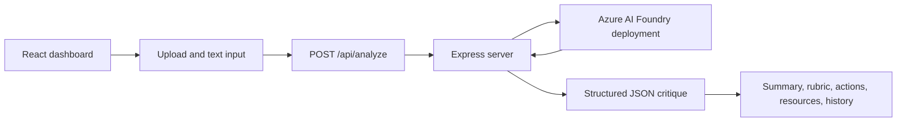

# InsightForge

InsightForge is a reasoning-agent workspace for constructive critique. It evaluates written content, finds weaknesses, builds practical improvement plans, and turns gaps into learning/resource queries.

Built with React, Vite, Tailwind CSS, Express, and Microsoft Azure AI Foundry.

## What It Does

- Critiques resumes, business ideas, startup pitches, project proposals, essays, documentation, notes, and drafts.
- Sends text and lightweight text-file content to an Azure AI Foundry model through a secure server endpoint.
- Returns structured analysis: summary, strengths, improvements, suggestions, resource queries, score, confidence, and rubric breakdown.
- Shows visible reasoning stages without exposing hidden chain-of-thought.
- Recommends useful learning/resource searches through a Foundry IQ-style resource layer.
- Keeps recent analysis history in browser storage so users can restore prior results during a demo.
- Exports the current critique as a local JSON file.
- Uses image uploads only as reference placeholders for now. Direct image critique requires a vision-capable model and is intentionally disabled.

## Current Scope

InsightForge is currently optimized for text-based critique.

Supported today:

- Pasted text
- Lightweight text files
- Document text copied into the text box
- Image reference uploads with a friendly limitation message
- Azure AI Foundry-backed analysis through `POST /api/analyze`

Not supported yet:

- Direct image pixel analysis
- OCR for screenshots or scanned files
- Native PDF text extraction
- Vision model deployment

## Architecture



## Project Structure

```text
public/                 Static assets
server/analyze.js        Secure Azure Foundry proxy and analysis endpoint
src/components/          Dashboard cards and UI sections
src/data/sampleData.js   Demo sample content
src/pages/Dashboard.jsx  Main app state and dashboard layout
src/services/            Frontend API client
src/index.css            Tailwind and visual styling
```

## Setup

Install dependencies:

```bash
npm install
```

Create a local environment file:

```bash
cp .env.example .env.local
```

Fill in `.env.local` with your Azure AI Foundry values. Keep these variables server-only. Do not rename them with a `VITE_` prefix because Vite exposes `VITE_` variables to browser JavaScript.

```env
AZURE_FOUNDRY_ENDPOINT=https://your-resource.services.ai.azure.com/api/projects/your-project
AZURE_FOUNDRY_API_KEY=replace-with-your-key
AZURE_FOUNDRY_DEPLOYMENT=your-deployment-name
AZURE_FOUNDRY_API_VERSION=2024-05-01-preview
PORT=8787
```

Run the API server:

```bash
npm run server
```

Run the frontend in a second terminal:

```bash
npm run dev
```

Open the app:

```text
http://127.0.0.1:5173
```

## Environment Variables

| Variable | Required | Purpose |
| --- | --- | --- |
| `AZURE_FOUNDRY_ENDPOINT` | Yes | Azure AI Foundry project/resource endpoint. |
| `AZURE_FOUNDRY_API_KEY` | Yes | Server-side API key. Never commit this. |
| `AZURE_FOUNDRY_DEPLOYMENT` | Yes | Deployment name configured in Foundry. |
| `AZURE_FOUNDRY_API_VERSION` | Yes | Azure API version. |
| `AZURE_FOUNDRY_TIMEOUT_MS` | No | Request timeout before fallback handling. |
| `AZURE_FOUNDRY_MAX_INPUT_CHARS` | No | Max text sent for analysis. |
| `AZURE_FOUNDRY_API_PATH` | No | Optional custom completions path. |
| `AZURE_FOUNDRY_AUTH_HEADER` | No | `api-key`, `authorization`, or `both`. |
| `BING_SEARCH_ENDPOINT` | No | Optional Bing Search endpoint for source snippets. |
| `BING_SEARCH_API_KEY` | No | Optional Bing key for richer resource cards. |
| `PORT` | No | API server port. Defaults to `8787`. |

## Scripts

| Command | Description |
| --- | --- |
| `npm run dev` | Start the Vite frontend on `127.0.0.1`. |
| `npm run server` | Start the secure analysis API server. |
| `npm run build` | Build the production frontend bundle. |
| `npm run preview` | Preview the production build locally. |

## Security Notes

- `.env.local` is intentionally ignored by Git.
- The browser never receives Azure keys.
- The frontend calls the local Express API, and the server performs the Foundry request.
- Use `.env.example` as the shareable template for configuration.

## Demo Positioning

> InsightForge is a reasoning agent that evaluates written content, identifies weaknesses, generates actionable improvement plans, and recommends learning resources through a Foundry IQ-style resource layer.

## Future Work

- Add PDF text extraction.
- Add OCR for scanned documents and screenshots.
- Add a vision-capable model for direct image critique.
- Add stronger grounded retrieval with verified source snippets.
- Add user accounts and cloud-backed analysis history.